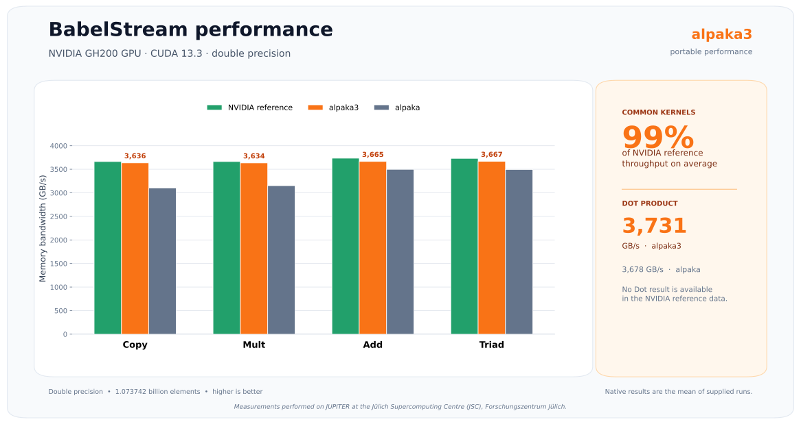
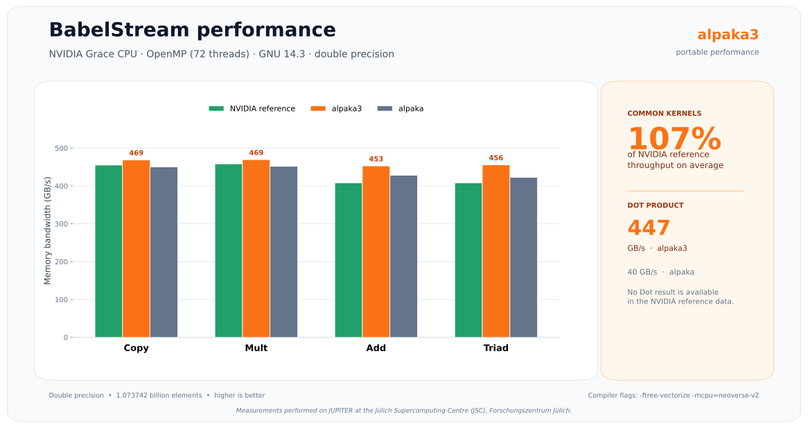

**alpaka** - Abstraction Library for Parallel Kernel Acceleration
=================================================================

[](https://www.mozilla.org/en-US/MPL/2.0/)
[](https://github.com/alpaka-group/alpaka/actions/workflows/ci.yml)
[](https://app.codecov.io/github/alpaka-group/alpaka)
[](https://alpaka.readthedocs.io)
[](https://alpaka.readthedocs.io/en/latest/doxygen/namespaces.html)
[](https://alpaka.readthedocs.io/en/latest/doxygen_dev/namespaces.html)
[](https://isocpp.org/std/the-standard)
[](https://github.com/alpaka-group/alpaka)
[](https://github.com/alpaka-group/alpaka)
[](https://github.com/alpaka-group/alpaka)


The **alpaka** library is a header-only C++20 abstraction library for accelerator development.

Its aim is to provide performance portability across accelerators by abstracting the underlying levels of parallelism.

The library is platform-independent and supports the concurrent and cooperative use of multiple devices, including host CPUs (x86, ARM, RISC-V, and Power8+) and GPUs from different vendors (NVIDIA, AMD, and Intel).
A variety of accelerator backends—CUDA, HIP, SYCL, OpenMP, and serial execution—are available and can be selected based on the target device.
Only a single implementation of a user kernel is required, expressed as a function object with a standardized interface.
This eliminates the need to write specialized CUDA, HIP, SYCL, OpenMP, or threading code.
Moreover, multiple accelerator backends can be combined to target different vendor hardware within a single system and even within a single application.

The abstraction is based on a virtual index domain decomposed into equally sized chunks called frames.
alpaka provides a uniform abstraction to traverse these frames, independent of the underlying hardware.
Algorithms to be parallelized map the chunked index domain and native worker threads onto the data, expressing the computation as kernels that are executed in parallel threads (SIMT), thereby also leveraging SIMD units.
Unlike native parallelism models such as CUDA, HIP, and SYCL, alpaka kernels are not restricted to three dimensions.
Explicit caching of data within a frame via shared memory allows developers to fully unleash the performance of the compute device.
Additionally, alpaka offers primitive functions such as iota, transform, transform-reduce, reduce, and concurrent, simplifying the development of portable high-performance applications.
Host, device, mapped, and managed multi-dimensional views provide a natural way to operate on data.

A dot product in one line
-----------------------

```c++
using namespace alpaka;

// Select the CPU device and the corresponding asynchronous queue.
auto device = onHost::DeviceSelector(api::host, deviceKind::cpu).makeDevice(0);
auto queue = device.makeQueue();

uint32_t const numElements = 128u;

// Allocate and initialize the input buffers and a single-element result buffer for the selected device.
concepts::IBuffer auto resultBuffer = onHost::allocUnified<double>(device, 1u);
concepts::IBuffer auto bufferLhs = onHost::alloc<double>(device, numElements);
onHost::iota(queue, 1.0, bufferLhs);
concepts::IBuffer auto bufferRhs = onHost::allocLike(device, bufferLhs);
onHost::fill(queue, bufferRhs, 42.0);

onHost::transformReduce(queue, 0.0, resultBuffer, std::plus{}, std::multiplies{}, bufferLhs, bufferRhs);
onHost::wait(queue);
std::cout<<"Result="<<resultBuffer[0]<<std::endl;
```

Test the example on [Godbolt](https://godbolt.org/z/naavGMnhY).

Performance portability
-----------------------

The BabelStream benchmark demonstrates that alpaka provides competitive memory-bandwidth performance across both CPU and GPU architectures using the same portable programming model.

The following measurements compare alpaka with mainline alpaka and NVIDIA's native reference implementations.
All results use double precision, and higher bandwidth is better.





Software License
----------------

**alpaka** is licensed under **MPL-2.0**.

Documentation
-------------

The documentation is available at: https://alpaka.readthedocs.io

Citation
--------

If you use **alpaka** in research, please cite it using the metadata in [CITATION.cff](CITATION.cff).
